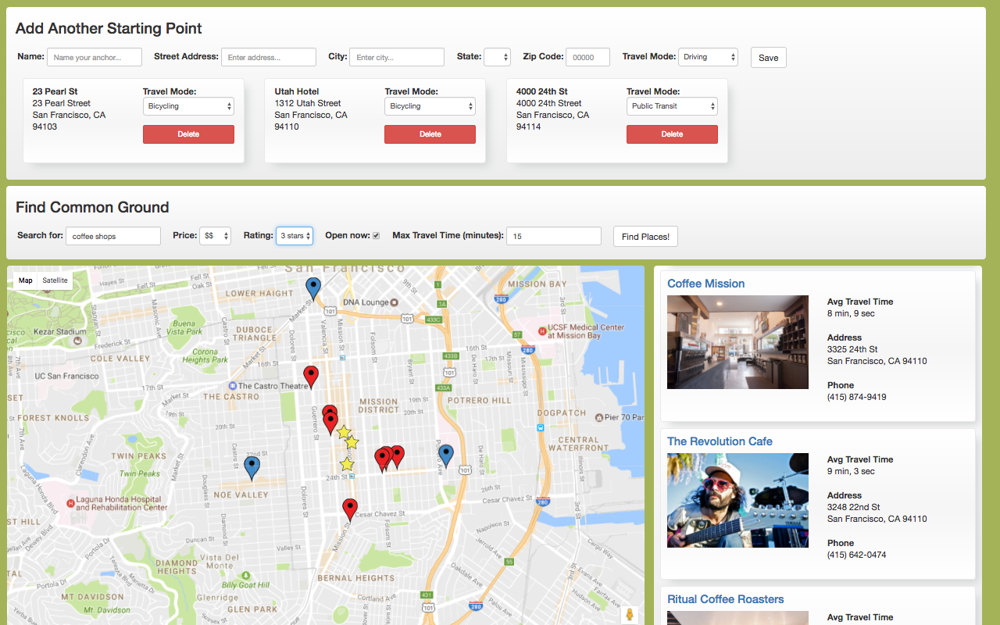

# Common Ground

 Want to meet up with friends after work, but can't find a good spot that's easy for everyone to get to? Common Ground locates optimal meeting places based on travel times. Simply enter your starting locations and a desired type of meeting place - for example 'bars' or 'german restaurants'. You can even select different travel modes for each person - walk, bike, drive or transit. 
 
 [Video Demo](https://youtu.be/I3OBtvNeGOs)  |  [Live Site](https://findcommonground.herokuapp.com/)
 
 


## Team

  - Justin Yoo (justinjyoo)
  - Matt Schmitz (mattschmitz)
  - Tyler Walker (twalk4821)
  - Innie Kim (ijongkim)

## Table of Contents

1. [Development](#development)
    1. [Requirements](#requirements)
    1. [Installing Dependencies](#installing-dependencies)
1. [Contributing](#contributing)
1. [Testing](#testing)
1. [License](#license)

## Development

### Requirements

- Node 6.4.x

### Installing Dependencies

From within the root directory:
```
npm install
```

## Contributing

See [CONTRIBUTING.md](CONTRIBUTING.md) for contribution guidelines.

## Testing

From within the root directory:
```
npm test
```

## License

MIT
